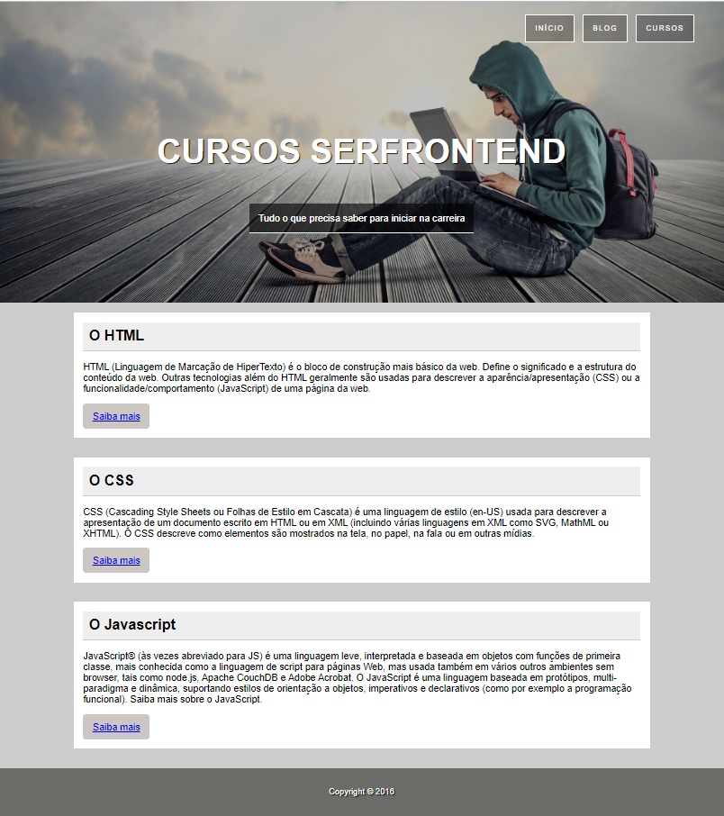

<h1 align="center"> SerFrontEnd </h1>

Programa exclusivo e pago, promovido pelo curso Webdesign Front-end.  
<a href="https://www.udemy.com/course/curso-web-design-fundamentos-aprenda-html-css-e-javascript/">Veja toda a grade do curso clicando aqui.</a>

  <a href="#-tecnologias">Tecnologias</a>&nbsp;&nbsp;&nbsp;|&nbsp;&nbsp;&nbsp;
  <a href="#-projeto">Projeto</a>&nbsp;&nbsp;&nbsp;|&nbsp;&nbsp;&nbsp;

 

  

## 🚀 Tecnologias

Esse projeto foi desenvolvido com as seguintes tecnologias:

- HTML e CSS
- Git e Github

## 💻 Projeto

O site simples foi uma forma de colocar em prática e treinar conceitos aprendidos.

